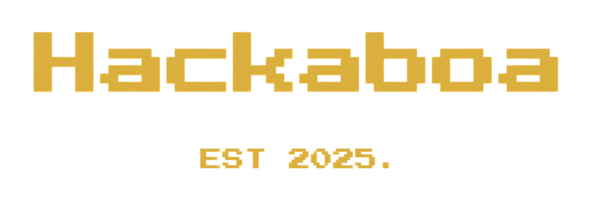

  

A community-run group of indie makers / coders / designers / hardware hackers who build their own independent apps/startups, meeting up every Thursday for weekly co-working (and demos) in Lisboa, Portugal.

Not in Lisboa? [More locations](https://hacka.network/?utm_source=hackaboa)

If you code your own projects come and join us every Thursday from 9.15am at a co-working space in Lisboa.

The usual schedule is:

* 9.30am – Intros (a little about yourself + what you're working on)
* 12:30pm – Local lunch together (if you want)
* 4pm – Demos (share what you made today, or just watch)
* 5pm – Drinks somewhere nearby 🍻🍷

Please fill out [this form](https://hackaboa.com) and we'll send you the details!
